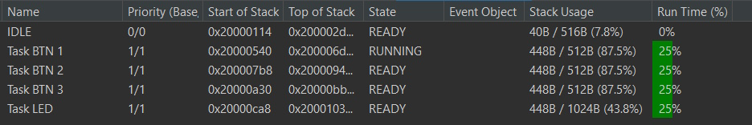
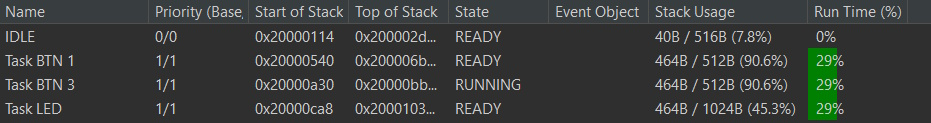

# Respuestas de Gemini a las Preguntas Planteadas

## ⏱️ ¿Cómo FreeRTOS asigna tiempo de procesamiento a cada Tarea?

Utilizando **SysTick**, en cada interrupción del Tick, el **Scheduler** evalúa el sistema. Si hay tareas con la misma prioridad, utiliza un mecanismo de programación **Round-Robin** (ronda de mate) para asignar equitativamente porciones de tiempo (**Time Slices**) a cada una de esas tareas.

---

## 🎯 ¿Cómo FreeRTOS elige qué Tarea debe ejecutarse en un momento dado?

Mediante el **Scheduler**, el cual ejecuta la tarea de mayor prioridad primero, y y luego desciende hasta la última a medida que las de mayor prioridad van cediendo el control.

---

## ⚖️ ¿Cómo la prioridad relativa de cada Tarea afecta el comportamiento del sistema?

Una tarea de mayor prioridad interrumpirá inmediatamente a una de menor prioridad en cuanto pase al estado **READY**. Esto significa que las tareas de baja prioridad solo obtendrán tiempo de CPU si todas las tareas de mayor prioridad están en estado **BLOCKED** o **SUSPENDED**.

---

## 🔄 ¿Cuáles son los estados en los que puede encontrarse una Tarea?

Una tarea en FreeRTOS siempre se encuentra en uno de estos cuatro estados:

1. **RUNNING** (Ejecutándose)
2. **READY** (Lista para ejecutarse)
3. **BLOCKED** (Bloqueada esperando un evento o tiempo)
4. **SUSPENDED** (Suspendida temporalmente)

---

## 🛠️ ¿Cómo implementar Tareas?

Las tareas se implementan como funciones en C que contienen un bucle infinito y nunca retornan:

```c
void Tarea(void const * argumento)
{
    // Código de inicialización de la tarea
    
    for(;;)
    {
        // Código de la tarea (bucle infinito)
        osDelay(100);
    }
}
```

---

## 🏗️ ¿Cómo crear una o más instancias de una Tarea?

Utilizando la API de CMSIS-OS, se hace en dos pasos: se define la estructura y luego se crean las instancias.

```c
// 1. Declaramos los "Handles" (identificadores) para cada instancia
TaskHandle_t instancia1;
TaskHandle_t instancia2;

// 2. Creación de las instancias
// Parámetros: Función, Nombre, Tamaño Pila, Argumento, Prioridad, Puntero al Handle
xTaskCreate(MiTarea, "Tarea 1", 128, (void*) 1, tskIDLE_PRIORITY + 1, &instancia1);
xTaskCreate(MiTarea, "Tarea 2", 128, (void*) 2, tskIDLE_PRIORITY + 1, &instancia2);
```

---

## 🗑️ ¿Cómo eliminar una Tarea?

Para destruir una tarea y liberar sus recursos:

```c
// Para eliminar una tarea específica indicando su Handle:
vTaskDelete(instancia1);

// Para que la tarea se elimine a sí misma (se llama dentro de su propio código):
vTaskDelete(NULL);
```
---

# Respuestas de Gemini a los Ejercicios

## Modificación de Prioridades Relativas (task_btn y task_led)

**Configuración realizada:**
Se modificaron las prioridades de las tareas en el archivo, alternando los niveles de prioridad entre `task_btn` y `task_led`.

**Observaciones del comportamiento:**
* **Prioridad `task_btn` > `task_led`:** El sistema responde de manera inmediata a la pulsación del botón. Como la tarea del botón tiene mayor prioridad, el planificador (scheduler) le otorga el procesador apenas se detecta el evento (o termina su tiempo de bloqueo), desplazando a la tarea del LED si fuera necesario.
* **Prioridad `task_led` > `task_btn`:** Si la tarea del LED realiza operaciones intensivas sin bloquearse (ej. bucles de delay por software en lugar de osDelay), se observa una degradación en la respuesta del botón. El botón solo se procesa cuando la tarea del LED entra en estado Blocked.
* **Conclusión:** Se comprobó que las prioridades relativas definen el determinismo del sistema. Para funciones de interfaz de usuario (como botones), una prioridad más alta mejora la experiencia de uso.

---

## Instanciación Múltiple y Eliminación de Tareas

**Configuración realizada:**
Se crearon tres instancias independientes de la tarea `task_btn` utilizando la misma función de entrada, pero con diferentes manejadores (*handles*) y estructuras de atributos. 
Se configuró la tarea `task_led` para que, bajo una condición específica (después del parpadeo), ejecute la función de eliminación sobre una de las instancias del botón (`task_btn_2`).

**Comportamiento observado:**
1. **Btn:** Al ejecutar el sistema, las tres instancias de la tarea compiten por el recurso del botón. Cada una mantiene su propio contexto de ejecución (stack), aunque ejecutan el mismo código lógico.
2. **Led:** Una vez que `task_led` elimina la instancia, se libera la memoria del Stack y el Control Block (TCB) de dicha tarea. El sistema continúa funcionando con las dos instancias restantes, demostrando la capacidad de FreeRTOS para gestionar el ciclo de vida de los hilos de ejecución en tiempo de ejecución.

**Conclusión:** La creación de múltiples instancias permite reutilizar código para periféricos similares, mientras que la eliminación de tareas es útil para gestionar procesos temporales, optimizando el uso de la memoria RAM del microcontrolador.

---

# Observaciones Propias

- Para modificar las prioridades relativas a las tareas, vamos a `app.c` y buscamos las primitivas `xTaskCreate` responsables de la creación de las mismas. Allí, modificamos el parámetro de prioridad de cada una.

- Al subir la prioridad de `"Task BTN"` (por ej. a `tskIDLE_PRIORITY + 2ul`), solamente se ejecuta la misma. Esto se evidencia en consola (solo aparecen mensajes asociados al botón, como `Task BTN is running` o `Task BTN - BTN PRESSED`), y por el hecho de que el LED no responde a las pulsaciones del botón.

- Al subir la prioridad de `"Task LED"` respecto de `"Task BTN"` sucede algo similar, solamente se ejecuta la tarea del LED, lo cual se ve en la consola y en el hecho de que ya no se comprueba el estado del botón (por lo que el LED siempre permanece apagado).

- Para crear tres instancias de `task_btn`, vamos a `app.c` y copiamos la primitiva `xTaskCreate` asociada, cambiando el nombre o identificador (colocamos `"Task BTN 1"`, `"Task BTN 2"` y `"Task BTN 3"`) así como el handle de cada tarea. Observamos que con el `TOTAL_HEAP_SIZE` por defecto (3072 bytes), no es posible asignarle un tamaño de stack de `2 * configMINIMAL_STACK_SIZE` a cada instancia, por lo que tuvimos que, o bien reducir el stack asignado a cada tarea a `configMINIMAL_STACK_SIZE`, o bien aumentar el `TOTAL_HEAP_SIZE` en el **.ioc** (por ejemplo a 5120 bytes).

- Al depurar el proyecto, vemos que todas las tareas aparecen correctamente en la FreeRTOS Task List.

<br>



<br>

- Sin modificar nada más en la función común de las tres instancias, como dice Gemini, las tres compiten por procesamiento, por lo que por la consola a veces salen mensajes asociados a una instancia, y a veces a alguna de las otras.

- Para eliminar una de las instancias, podemos ir a `task_led.c` y buscar el código de la transición del estado `ST_LED_XX_OFF` a `ST_LED_XX_BLINK`. Allí, colocamos:
```
// Delete one of the button tasks.
LOGGER_INFO("Deleting task.");
vTaskDelete(h_task_btn_2);
LOGGER_INFO("Task deleted.");
```

- Observamos así que al pulsar el botón y cambiar el estado del LED, la instancia 2 efectivamente se elimina y desaparece de la lista de tareas:

<br>

